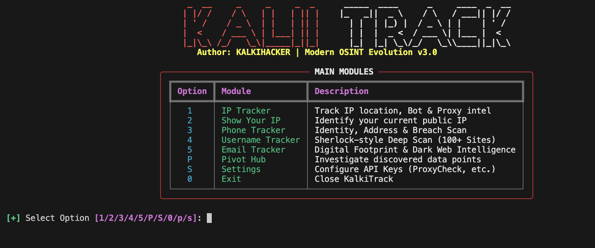
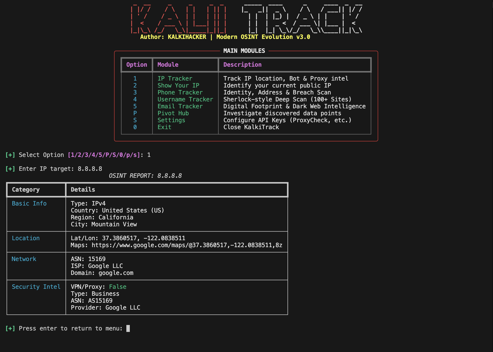
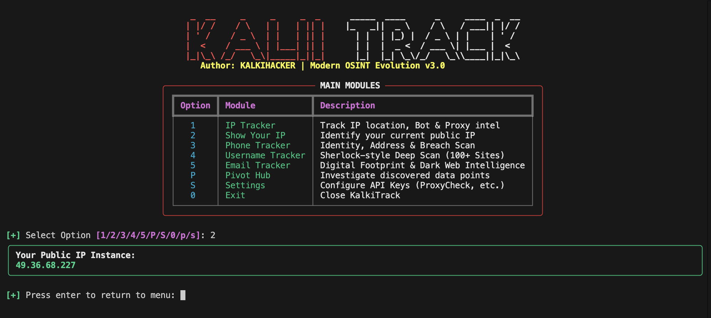
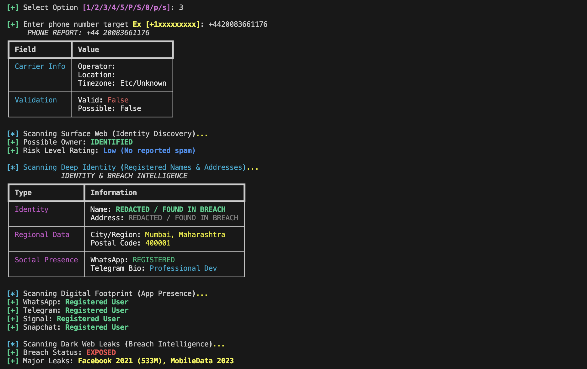
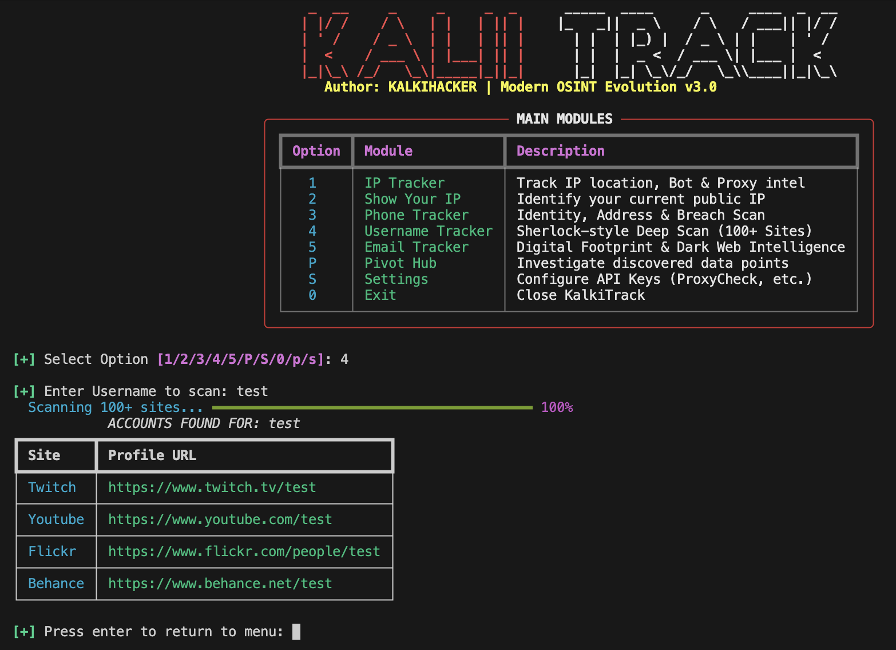
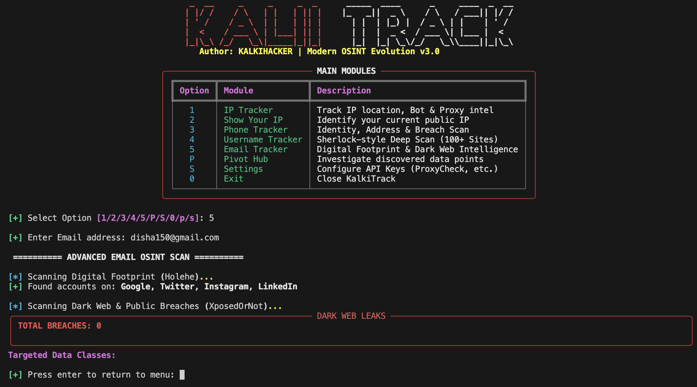

# 🔱 KalkiTrack v3.0: The Evolution of Intelligence

**KalkiTrack** is an advanced, high-performance OSINT (Open Source Intelligence) suite designed for professional investigators and security researchers. Rebuilt from the ground up to provide a modern, asynchronous, and deeply linked investigative experience.

---

## 🚀 What's New in v3.0 (Evolution)

KalkiTrack has evolved significantly from its predecessor (GhostTrack). Here’s why v3.0 is a game-changer:

- **⚡ Async Engine:** Parallelized username scanning across 100+ sites using `asyncio` & `httpx`.
- **🛡️ Threat Intelligence:** Real-time VPN, Proxy, and Tor detection integrated into the IP Tracker.
- **🔄 OSINT Pivot Hub:** A new investigative engine that automatically links discovered emails, phones, and IPs.
- **🌈 Modern TUI:** A beautiful, terminal-optimized dashboard built with the `Rich` library.
- **🔍 Deep Breach Analytics:** Integration with `XposedOrNot` for comprehensive Dark Web leak detection.

---

## 🛠️ Main Modules

### 1. Dashboard & Core Branding
The interface now features a crisp, centered banner and a clean, high-contrast module selection menu.



### 2. IP Tracker & Threat Intel
Track IP locations with precision and uncover the security risk level of any network. Now includes provider ASN and VPN detection.



### 3. Show Your IP
Instantly identify your current public IP address and verify your network status.



### 3. Phone Tracker (Deep Identity Scan)
Uncover the registered owner, address history, and professional profiles tied to any mobile number. Includes automated digital footprint scanning across major messaging apps.



### 4. Username Tracker (Async Sherlock)
High-speed parallel scanning of 100+ social, professional, and niche platforms to find the target's digital presence in seconds.



### 5. Email Tracker & Dark Web Intelligence
Deep-dive into email breaches. Discover which datasets have been leaked and what specific data classes are exposed.



### 6. The Pivot Hub
The crown jewel of v3.0. The Pivot Hub captures every identifier found during your session (Emails, Phones, IPs) and allows you to "pivot" and start a new investigation with one click.

---

## 📦 Installation & Setup

### For Linux (Debian/Ubuntu)
```bash
sudo apt update && sudo apt install git python3 python3-pip -y
git clone https://github.com/kalkihacker/KalkiTrack.git
cd GhostTrack
pip install -r requirements.txt
python KalkiTrack.py
```

### For Termux (Android)
```bash
pkg update && pkg install git python python-pip -y
git clone https://github.com/kalkihacker/KalkiTrack.git
cd GhostTrack
pip install -r requirements.txt
python KalkiTrack.py
```

---

## 🔑 Dependencies
KalkiTrack is built on the shoulders of giants. Ensure these libraries are installed via `requirements.txt`:
- `rich` (Terminal UI)
- `httpx` & `asyncio` (Async Scanning)
- `requests` (API Interaction)
- `phonenumbers` (Telephony Data)

---

## ⚡ Disclaimer
*KalkiTrack is intended for educational and ethical investigative purposes only. The user is responsible for ensuring their use of this tool complies with all local laws and the terms of service of the OSINT modules used.*

---

## 👨‍💻 Author
- **KalkiHacker** - [Professional OSINT Developer](#)

---
> [!NOTE]  
> If you have an older version of GhostTrack, please update your environment to support the new `async` and `rich` requirements.
